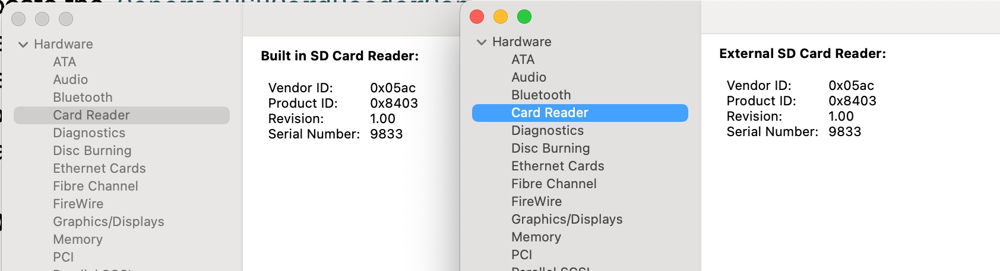

#  Frequently Asked Questions

**Last Updated:** Jul 25, 2021

## >> Guide to customize the plugin

**Step 1:** Find the `Product ID` and the `Vendor ID` of your card reader (see below) and convert them to decimal values.  
**Step 2:** Download the latest release version.  
**Step 3:** Open `Info.plist` in `GenericCardReaderFriend.kext/Contents`.  
**Step 4:** Locate the `GenericUSBCardReaderController` entry under `IOKitPersonalities`.  
**Step 5:** Replace the value of `idProduct` with your **decimal** product id you found in Step 1.  
**Step 6:** Replace the value of `idVendor` with your **decimal** product id you found in Step 1.  
**Step 7:** You may change the value of `Physical Interconnect Location` to `External` (see below).  
**Step 8:** Save your changes and install the driver.  

## >> How do I find the product and the vendor ID of my card reader?
Open `System Information` and click the tab `USB`.  
Find your card reader under the `USB Device Tree`.  
Click the entry and you should be able to see the hexadecimal representation of both identifiers below.

## >> When should I change the value of `Physical Interconnect Location` to `External`?

#### Short Story:
In short, it does not matter at all.   
Changing the value to `External` will change the title of your card reader to `External SD Card Reader` in `System Information`.

#### Long Story:
You may notice that your USB card reader shows up in the system only when you insert a SD card.  
In this case, your card reader works like a thumb drive, and System Information will list it only when the card is present.  
So, you may want to change the value to `External` to describe such behavior more precisely.  
On the contrary, if your card reader shows up even if the card is not present, you may change the value to `Internal`.

## >> Can I change the value of other entries in `IOKitPersonalities`?
No, you should not.

## >> Why can't System Information present card information like Realtek Card Reader Friend?
You may think of your card reader having its own firmware to do all dirty work, such as chip initialization, card detection and initialization, behind the scenes 
and exposing a USB mass storage interface to the system. Your card reader may hide all details about the card, so the dummy driver in this plugin has no way to fetch those information. In contrast, both `AppleUSBCardReader.kext` and `RealtekCardReader.kext` initialize the card reader and the card by themselves, 
so they know everything about the card you inserted and can publish those properties to IORegistry which are subsequently read by System Information.
