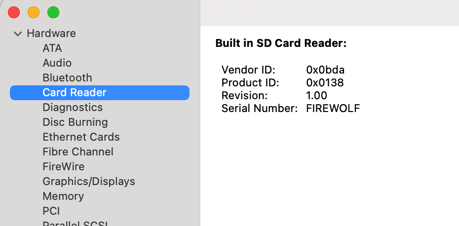

#  Generic Card Reader Driver Friend

## Introduction

A Lilu plugin that makes System Information recognize your builtin USB card reader as a native one.

## Supported Systems
- macOS Ventura
- macOS Monterey
- macOS Big Sur  
- macOS Catalina  
- macOS Mojave
- macOS High Sierra
- macOS Sierra
- macOS El Capitan

## Dependencies
- [Lilu](https://github.com/acidanthera/Lilu) v1.4.7 or later.

## Limitations & Notes
- This plugin contains a dummy driver that attaches to your USB card reader and injects necessary properties.
- This plugin is derived from but **NOT** compatible with [RealtekCardReaderFriend](https://github.com/0xFireWolf/RealtekCardReaderFriend/).
- This plugin is for decoration purposes only, and your card information will **NOT** be present by System Information.
- This plugin does **NOT** work out of box, and you must follow the [guide](FAQ.md) to specify the vendor and the product identifiers of your card reader.
- If your card reader is powered by either [`AppleUSBCardReader.kext`](file:///System/Library/Extensions/AppleStorageDrivers.kext/Contents/PlugIns/AppleUSBCardReader.kext) or [`RealtekCardReader.kext`](https://github.com/0xFireWolf/RealtekCardReader), you should **NOT** use this plugin.

## Support
If you would like to support my work, please consider a donation.  

## Boot Arguments
- `-gcrfoff` (or `-liluoff`) to disable
- `-gcrfdbg` (or `-liludbgall`) to enable verbose logging (in DEBUG builds)
- `-gcrfbeta` (or `-lilubetaall`) to enable on macOS newer than 12

## Credits
- [vit9696](https://github.com/vit9696) for [Lilu.kext](https://github.com/vit9696/Lilu)
- [Acidanthera](https://github.com/acidanthera) for [MacKernelSDK](https://github.com/acidanthera/MacKernelSDK)
- [FireWolf](https://github.com/0xFireWolf) for developing the card reader driver and its companion Lilu plugin for macOS

## Acknowledgement
- [dreamwhite](https://github.com/dreamwhite) for testing the early beta release.

## License
This project is licensed under BSD-3-Clause.  
Copyright (C) 2021 FireWolf @ FireWolf Pl. All Rights Reserved.
